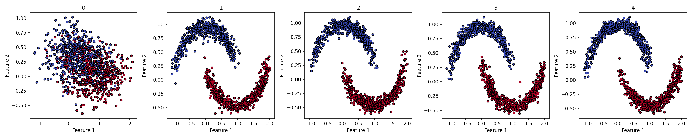
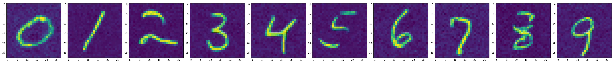

# Bayesian Flow Networks

A PyTorch implementation of [Bayesian Flow Networks (Graves et al., 2023)](https://arxiv.org/abs/2308.07037).

See my explanatory blog post [here](https://maximerobeyns.com/bayesian_flow_networks).

## Installation

```bash
git clone https://github.com/MaximeRobeyns/bayesian_flow_networks
cd bayesian_flow_networks
pip install -e .
```

## Examples

### Continuous Data (swiss roll)

Both the infinite and discrete time loss functions are implemented.

Here is a minimal example for the 2D swiss roll dataset (see
`examples/swiss_roll_bfn.py` for the full code). The following diagram shows
some model samples throughout training:


```python
# Imports
import torch
from torch_bfn import ContinuousBFN, LinearNetwork
from torch_bfn.utils import EMA

# Setup a suitable network
net = LinearNetwork(dim=2, hidden_dims=[512, 512], sin_dim=16, time_dim=64)

# Setup the BFN
model = ContinuousBFN(dim=2, net=net)

# Setup training
opt = torch.optim.AdamW(model.parameters(), lr=1e-3)
ema = EMA(0.9)
ema.register(model)

# Load data (see examples/swiss_roll_bfn)
train_loader = ...

# Train the model
for epoch in range(100):
    for batch in train_loader:
        X = batch[0].to(device, dtype)
        # For continuous loss:
        loss = model.loss(X, sigma_1=0.01).mean()
        # For discrete-time loss:
        # loss = model.discrete_loss(X, sigma_1=0.01, n=30).mean()
        opt.zero_grad()
        loss.backward()
        torch.nn.utils.clip_grad_norm_(model.parameters(), 1.0)
        opt.step()
        ema.update(model)

# Sample from the model
samples = model.sample(1000, sigma_1=0.01, n_timesteps=10)
```

### Conditional Generation with Classifier-Free Guidance (Two Moons)

Generating data conditioned on labels using classifier-free guidance is also
implemented.

To use this, simply pass the conditioning information (either class labels, or
a continuous vector) to the loss function during training:

```python
# continuous-time version
loss = model.loss(X, y, sigma_1=0.01).mean()
# discrete-time version
loss = model.discrete_loss(X, y, sigma_1=0.01, n=30).mean()
```

With a training loop that looks very similar to the one above for the swiss
roll dataset (see `examples/two_moons_classifier_free_guidance.py` for the full
code), we obtain the following samples throughout training (with the
conditioning class labels drawn uniformly at random).



The `sample` method of the `ContinuousBFN` class accepts a `cond` argument
which allows you to provide either class labels or continuous vectors, as well
as a `cond_scale` and `rescaled_phi` argument to influence how strong the
conditioning signal is. Note that we still have the `n_samples` argument,
allowing us to draw multiple samples conditioned on the same input. If you omit
the `cond` argument for a conditional model, unconditional samples will be
drawn.

```python
# Draw samples, shape [2, 1000, n_dims]
samples = model.sample(1000, cond=t.arange(2), cond_scale=1.7)
class_1_moon, class_2_moon = samples
```


### Classifier-Free Guidance with Continuous Data (MNIST)

For an example of training a UNet on MNIST with classifier-free guidance, see
`examples/MNIST_continuous_bfn.py`.



Here is the main gist of what's going on:

```python

# Get data loader (see examples/MNIST_continuous_bfn.py) for full code
train_loader = get_mnist()

# Create the UNet for MNIST
net = Unet(
    dim=256,
    channels=1,
    dim_mults=[1, 2, 2],
    num_classes=10,
    cond_drop_prob=0.5,
    flash_attn=True,
)

# Create the BFN
model = ContinuousBFN(dim=(1, 28, 28), net=net)

# Setup training
ema = EMA(0.99)
opt = t.optim.AdamW(
    model.parameters(), lr=1e-4, weight_decay=0.01, betas=(0.9, 0.98)
)
ema.register(model)

# Run training loop
for epoch in range(epochs):
    for batch in train_loader:
        X, y = batch
        # Continuous-time loss
        loss = model.loss(X, y, sigma_1=0.01).mean()
        # Discrete-time loss
        # loss = model.discrete_loss(*batch, sigma_1=0.01, n=30).mean()
        opt.zero_grad()
        loss.backward()
        t.nn.utils.clip_grad_norm_(model.parameters(), 1.0)
        opt.step()
        ema.update(model)

# Draw some samples from the model
sample_classes = t.arange(10)
samples = model.sample(1, cond=sample_classes, cond_scale=7.)
```
